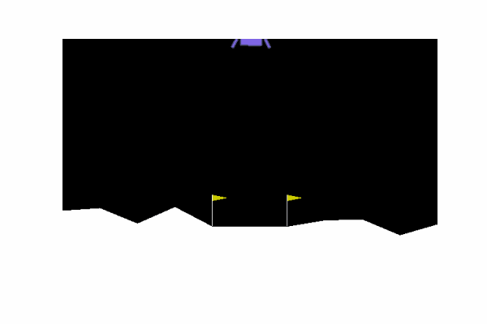

# RLChess

### Team members:
Borja García, Pol García, Sergi Parera, Sergi Sellés
### Advisor:
Daniel Fojo

## Project goals
### The algorithm Works
The algorithm is working and is able to play games. The result is irrelevant as long as the game is finished.
### The algorithm is not just random
The algorithm learns how to win games, achieving a positive and significant ratio win/loss against a random-movement player
### The algorithm aims to win
Explore how the algorithm performs against a 1000-ELO player. This score is the entry point for all players, which means the player knows the basic rules and strategies in chess. This is clearly.
### Doing the same with less
Optimize the algorithm in order to do the same as above but with less resources. This would be the last step in our journey. It is not really related to any of the goals above, but it would be our next step towards excellence.

## Environment setup
We didn’t want to start the simulation always from the initial board because we thought it would be slow to train full games so we wanted to feed the network with already initialized boards from a database to make it learn not only how to start a game but also how to end one.  
With the original environment it was not possible, so we created our custom environment using a modified Board Encoding function that we could understand. Then we just wrote the rest of the functions to move, print the board and the legal actions using python chess as a backend.

# Reinforcement learning algorithms

## Policy Gradient
### Hypothesis
### Experiment setup
### Results
### Conclusions (new hypothesis)

## DQN
### Hypothesis
### Experiment setup
### Results
### Conclusions (new hypothesis)

## Proximal Policy Optimization (PPO)
### Hypothesis
### Experiment setup
### Results
#### CartPole

#### Lunar Lander

#### Chess
## Conclusions

## Next steps

## References